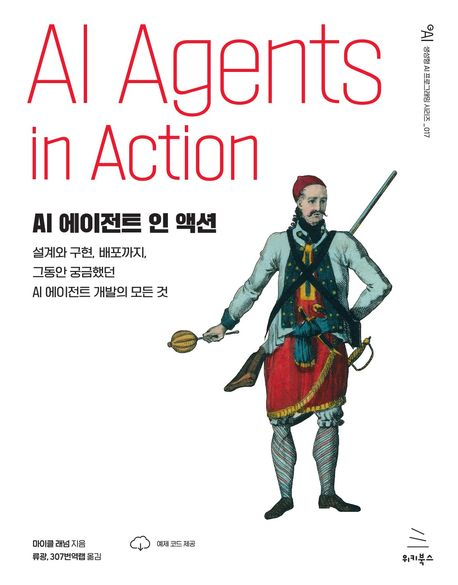

# GPT-에이전트 (AI Agents In Action): AI 에이전트와 어시스턴트의 세계 탐구

## 책 소개
"Manning Publications"에서 출간한 "AI Agents in Action"은 대형 언어 모델이 탑재된 에이전트와 어시스턴트의 세계를 통찰력 있게 탐구하는 책입니다. 이 책은 AI 및 머신러닝 분야에서 GPT 에이전트를 이해하고 개발하며 활용하는 데 필요한 포괄적인 가이드를 제공합니다.

### 주요 주제
- **에이전트 이해하기**: 에이전트의 개념, 역사, AI에서의 현재 역할을 살펴보고, 에이전트와 어시스턴트(자율 에이전트 포함)를 구분합니다.
- **에이전트 구성 요소**: 에이전트를 구성하는 프로필, 행동, 메모리, 계획 기능 등 복잡한 구성 요소를 탐구합니다.
- **AI 에이전트의 진화**: 소프트웨어 개발에서 GPT 에이전트의 빠른 발전과 AI 연구에서의 중요성 증대를 추적합니다.
- **AI 인터페이스 개발**: 소프트웨어와 데이터에서 자연어 인터페이스로의 전환과 효과적인 GPT 인터페이스 구축 방법을 배웁니다.
- **에이전트 도구 및 플랫폼**: 실용적인 적용에 중점을 두고, 효과적인 GPT 에이전트 시스템 구축에 필수적인 다양한 도구와 플랫폼을 소개합니다.

### 목표
이 책은 AI, 머신러닝, 그리고 혁신적인 GPT 에이전트의 세계에 대한 이해를 심화하고자 하는 분들을 위해 맞춤 제작되었습니다. AI 에이전트와 어시스턴트의 끊임없이 진화하는 환경에서 이론적 지식과 실용적 응용 모두를 위한 기초 자료로 활용할 수 있습니다.

---

